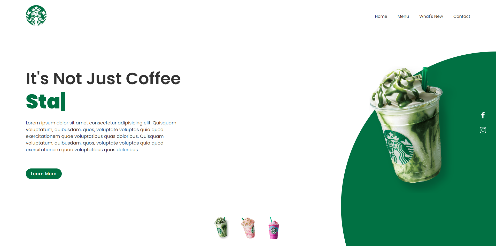

### Weather App

In this tutorial , I am gonna showing to you how to code a weather app with javascript. in this tutorial also we use a weather api and we get data from api❗️

## Warning

```javascript
function imgSlider(anything) {
  document.querySelector(".class").src = anything;
}
```

# Screenshot

Here we have project screenshot :


